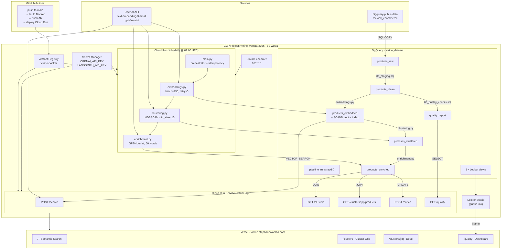
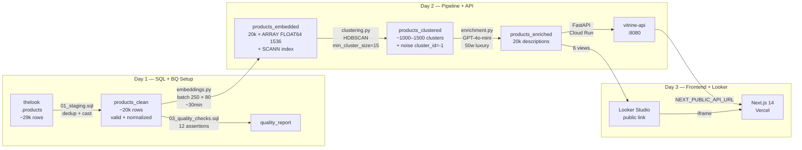
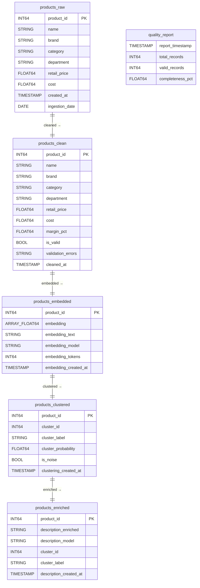
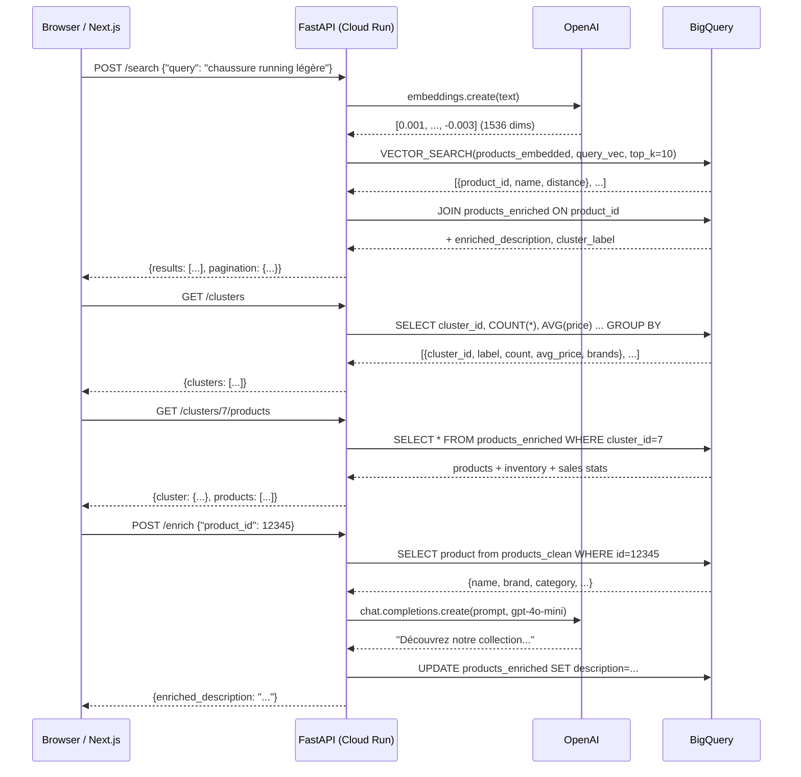
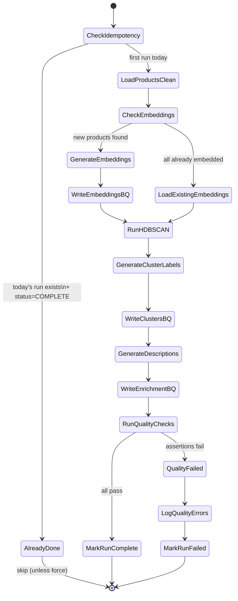
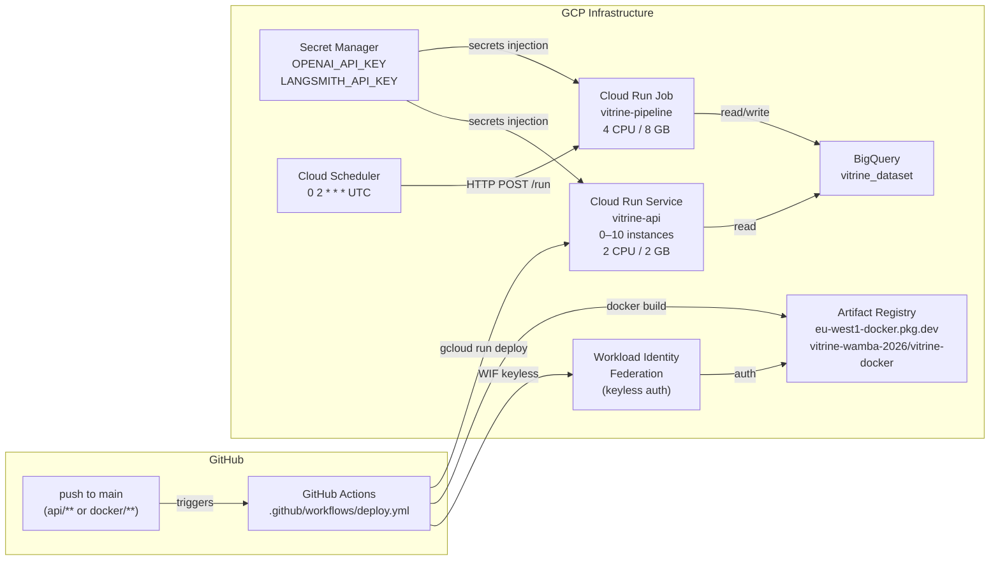
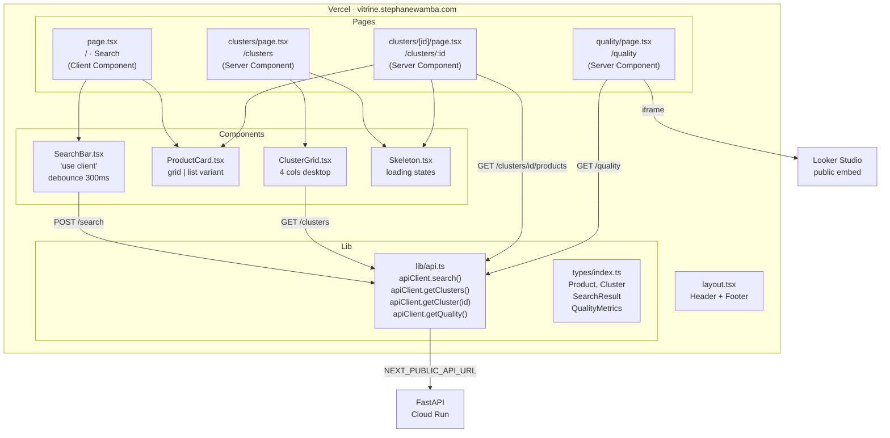

# Vitrine — Design Document
**Date:** 2026-03-25
**Deadline:** 2026-03-30 (Davidson interview with Arnaud)
**GCP Project:** `vitrine-wamba-2026`

---

## 1. System Architecture

---

## 2. Data Flow

---

## 3. BigQuery Schema

---

## 4. API Contract

---

## 5. Pipeline Orchestration

---

## 6. Infrastructure & CI/CD

---

## 7. Frontend Architecture

---

## 8. Implementation Plan

### Day 1 — Wednesday 26/03: GCP Setup + SQL + BigQuery

| # | Task | File | Notes |
|---|------|------|-------|
| 1.1 | Enable GCP APIs | `infra/setup.sh` | bigquery, run, artifactregistry, secretmanager, cloudscheduler |
| 1.2 | Create service accounts + IAM | `infra/iam.sh` | vitrine-cloud-run SA with minimal roles |
| 1.3 | Create BigQuery dataset + tables | `sql/00_create_tables.sql` | vitrine_dataset, EU region |
| 1.4 | Staging SQL | `sql/01_staging.sql` | Copy + dedup from thelook_ecommerce |
| 1.5 | Transform SQL | `sql/02_transform.sql` | Normalize, impute, validate, margin_pct |
| 1.6 | Quality checks SQL | `sql/03_quality_checks.sql` | 12 assertions + quality_report table |
| 1.7 | Create VECTOR_SEARCH index | `sql/04_vector_index.sql` | SCANN index on products_embedded.embedding |
| 1.8 | Create Looker Studio views | `sql/05_looker_views.sql` | 6 views for dashboard |
| 1.9 | Run SQL + validate in BQ console | — | Verify row counts + quality metrics |

### Day 2 — Thursday 27/03: Pipeline + API + Docker + Cloud Run

| # | Task | File | Notes |
|---|------|------|-------|
| 2.1 | `embeddings.py` | `pipeline/embeddings.py` | Batch 250, retry×5, write ARRAY<FLOAT64> to BQ |
| 2.2 | `clustering.py` | `pipeline/clustering.py` | HDBSCAN min_size=15, GPT-4o-mini labels |
| 2.3 | `enrichment.py` | `pipeline/enrichment.py` | 50-word luxury descriptions per cluster |
| 2.4 | `main.py` orchestrator | `pipeline/main.py` | Idempotency via pipeline_runs table |
| 2.5 | FastAPI routes | `api/main.py` + `api/routers/*.py` | /search /clusters /enrich /quality |
| 2.6 | BigQuery service | `api/services/bigquery.py` | VECTOR_SEARCH + cluster queries |
| 2.7 | OpenAI service | `api/services/openai.py` | Embedding + enrichment calls |
| 2.8 | Pydantic models | `api/models/*.py` | SearchRequest, ProductResult, Cluster, QualityMetrics |
| 2.9 | Dockerfile | `docker/Dockerfile` | Multi-stage, non-root user, port 8080 |
| 2.10 | Store secrets | — | `gcloud secrets create openai-api-key` |
| 2.11 | Push image + deploy API | — | `gcloud run deploy vitrine-api` |
| 2.12 | Deploy pipeline job | — | `gcloud run jobs create vitrine-pipeline-job` |
| 2.13 | Create Cloud Scheduler | — | `0 2 * * *` cron trigger |

### Day 3 — Friday 28/03: Frontend + Vercel + Looker + README

| # | Task | File | Notes |
|---|------|------|-------|
| 3.1 | Init Next.js 14 app | `frontend/` | `npx create-next-app@latest` + Tailwind |
| 3.2 | TypeScript types | `frontend/types/index.ts` | Product, Cluster, SearchResult, QualityMetrics |
| 3.3 | API client | `frontend/lib/api.ts` | apiClient with all 4 endpoints |
| 3.4 | SearchBar component | `frontend/components/SearchBar.tsx` | Debounce 300ms, loading state |
| 3.5 | ProductCard component | `frontend/components/ProductCard.tsx` | grid/list variants |
| 3.6 | ClusterGrid component | `frontend/components/ClusterGrid.tsx` | Responsive 4→2→1 cols |
| 3.7 | Page `/` | `frontend/app/page.tsx` | Search bar + results |
| 3.8 | Page `/clusters` | `frontend/app/clusters/page.tsx` | Server component + Suspense |
| 3.9 | Page `/clusters/[id]` | `frontend/app/clusters/[id]/page.tsx` | Cluster detail + products |
| 3.10 | Page `/quality` | `frontend/app/quality/page.tsx` | KPIs + Looker iframe |
| 3.11 | Deploy to Vercel | — | `vercel --prod` + env vars |
| 3.12 | Create Looker Studio dashboard | — | 6 charts, share public link |
| 3.13 | GitHub Actions workflow | `.github/workflows/deploy.yml` | Workload Identity + Cloud Run |
| 3.14 | Write README | `README.md` | Architecture diagram + 3 links |

### Day 4 — Sunday 29/03: Buffer + Polish + Send

| # | Task |
|---|------|
| 4.1 | End-to-end test: search → results → cluster detail |
| 4.2 | Check Looker Studio data freshness |
| 4.3 | Polish README with final links |
| 4.4 | Send 3 links to Arnaud: app live + Looker Studio + GitHub |

---

## 9. Deliverables

| Deliverable | URL |
|---|---|
| App live | `https://vitrine.stephanewamba.com` |
| Looker Studio | `https://lookerstudio.google.com/reporting/[ID]` |
| GitHub repo | `https://github.com/StephaneWamba/vitrine` |

---

## 10. Tech Stack Summary

| Layer | Technology |
|---|---|
| Data warehouse | BigQuery (GCP, EU region) |
| Vector search | BigQuery VECTOR_SEARCH (SCANN index) |
| Embeddings | OpenAI text-embedding-3-small (1536 dims) |
| Clustering | HDBSCAN (min_cluster_size=15, metric=cosine) |
| GenAI enrichment | GPT-4o-mini (cluster labels + 50-word descriptions) |
| LLM monitoring | LangSmith |
| Pipeline | Cloud Run Job (Python 3.11) |
| API | FastAPI + Uvicorn (Cloud Run Service) |
| Containerization | Docker multi-stage (non-root, port 8080) |
| Frontend | Next.js 14 + Tailwind CSS (App Router) |
| Frontend deploy | Vercel |
| Dashboard | Looker Studio (public, BigQuery-connected) |
| CI/CD | GitHub Actions + Workload Identity Federation |
| Secrets | GCP Secret Manager |
| Python deps | uv (package manager) |

---

## 11. Cost Estimate

| Service | Monthly cost |
|---|---|
| BigQuery (storage + queries) | ~$5.75 |
| Cloud Run (API + Job) | ~$2.71 |
| Cloud Scheduler | ~$0.10 |
| Secret Manager | ~$0.15 |
| Artifact Registry | ~$0.10 |
| OpenAI (one-time pipeline run) | ~$4.03 |
| Monitoring / Logging | ~$0.50 |
| **Total** | **~$13.34/month** |

---

## 12. Risks & Mitigations

| Risk | Mitigation |
|---|---|
| HDBSCAN finds too few clusters (<10) | Assertion in 03_quality_checks + fallback to KMeans |
| OpenAI rate limit during batch embed | Exponential backoff + batch size 250 |
| Cloud Run cold start >15s | min-instances=1 for API |
| BigQuery VECTOR_SEARCH index not ready | Assert index exists before first /search |
| Looker Studio iframe CSP blocked | Fallback link in /quality page |
| 3-day deadline miss | Day 3 tasks are optional polish; MVP = SQL + Pipeline + API |
